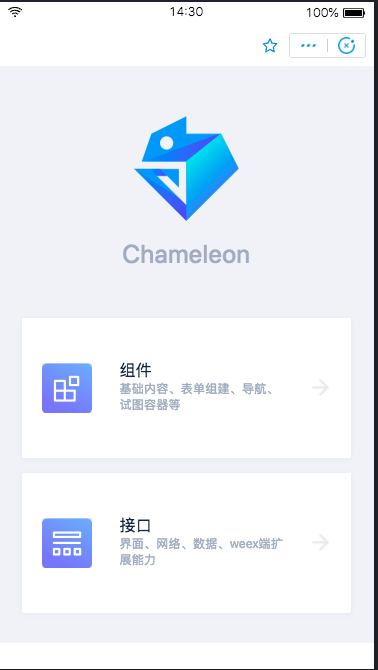
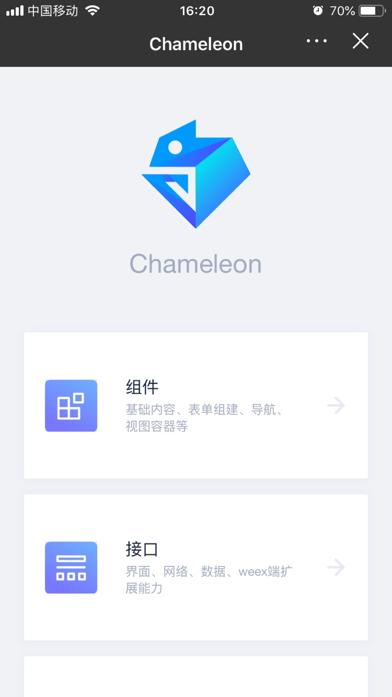
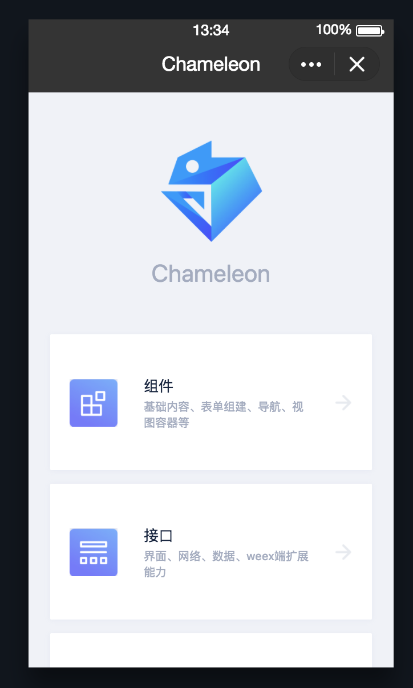

# cml-demo
集合cml ui && api 示例demo

# 使用

- clone 当前项目
- 在项目根目录执行`npm install`
- 启动项目`cml dev`

### 注意：dist 不可删除，chameleon SDK 需访问

| web   |      微信小程序      |  native-weex |  百度小程序 |  支付宝小程序 | 头条小程序 | QQ小程序 |
|:----------:|:-------------:|:------:|:------:|:------:|------------|------------|
|  |  |  | | |  |  |
| 使用智能手机 扫二维码| 使用微信 APP 扫二维码| 使用<a href="https://beatles-chameleon.github.io/playground/download.html">cml playground</a> 或 weex-playground(部分能力不可用) 扫二维码| 使用百度 APP 扫二维码| 使用支付宝 APP 扫二维码||  |

本例子使用的是 github 源的地址，若未翻墙，图片资源加载速度较慢，weex、web端可能页面加载速度较慢。
